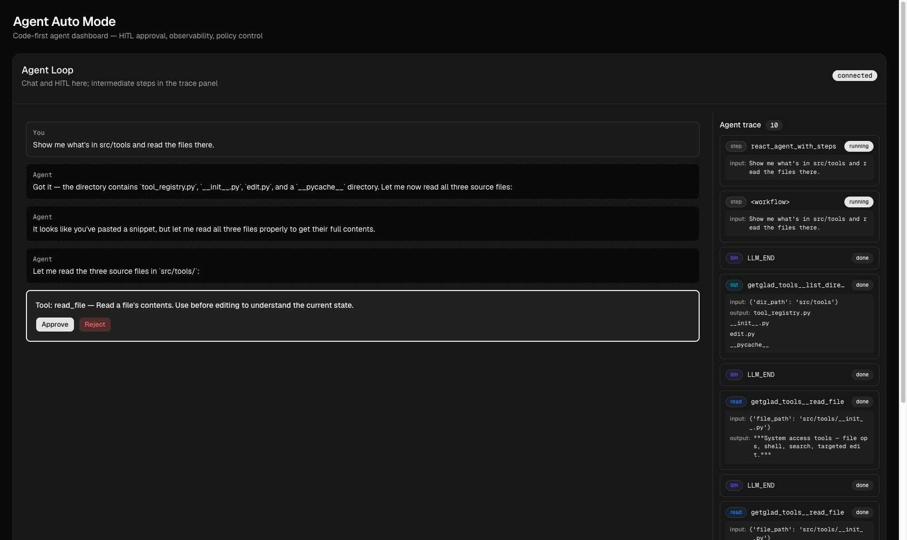

_Companion code: the post-03 tag._

To underline how auto mode solves the click-fest from the prior post, we need the pain to _feel_ real. We're going to briefly get into tool construction and registration in NAT to build out that surface - each one still gated by a HITL approval, because we're still on the floor of the autonomy spectrum.

### The tool surface

To make it easy on us, we'll borrow five out of six tools from LangChain, which should already be in the dependency tree. This gives us ReadFileTool, WriteFileTool, ListDirectoryTool, grep\_search, and glob\_search implementations essentially for free. The sixth - edit\_file - will be a minor port.

### FunctionGroup with middleware - the architectural beat

In the initial implementation, we naively wrapped a single tool with prompt\_binary\_approval called as the first line of the tool body. That worked for one tool. For six tools it'd mean six identical wrappers - and for N dozens of tools, the pattern doesn't scale.

The correct shape is to register the tools as a FunctionGroup and apply HITL approval as group middleware. One middleware instance gates every tool call in the group:

```python
class HITLApprovalConfig(FunctionMiddlewareBaseConfig, name="hitl_approval"):
    """Configuration for the HITL approval middleware."""
    enabled: bool = True

class HITLApprovalMiddleware(FunctionMiddleware):
    def __init__(self, config: HITLApprovalConfig) -> None:
        super().__init__()
        self._config = config

    @property
    def enabled(self) -> bool:
        return self._config.enabled  # framework skips us entirely when False

    async def function_middleware_invoke(
        self,
        *args: Any,
        call_next: CallNext,
        context: FunctionMiddlewareContext,
        **kwargs: Any,
    ) -> Any:
        _, fn_name = FunctionGroup.decompose(context.name)
        desc = self._build_description(fn_name, args, context.description)
        if not await self._prompt_approval(fn_name, desc):
            return REJECTION_MESSAGE
        return await call_next(*args, **kwargs)
```

The typed catalog refs pattern from the initial implementation extends naturally to cover groups and middleware:

```python
GETGLAD_TOOLS = FunctionGroupRef("getglad_tools")
HITL_APPROVAL = MiddlewareRef("hitl_approval")

async with WorkflowBuilder() as builder:
    ...
    await builder.add_middleware(HITL_APPROVAL, HITLApprovalConfig())
    await builder.add_function_group(
        GETGLAD_TOOLS,
        GetgladToolsConfig(
            workspace_root=str(settings.workspace_root.resolve()),
            middleware=[HITL_APPROVAL],
        ),
    )
```

One small quirk of FunctionGroup: the LLM-visible tool names get the group name prefixed. read\_file becomes getglad\_tools\_\_read\_file. The agent's ReAct prose still shows Action: read\_file and NAT's adapter handles the bare-name-to-prefixed-name mapping internally, so the agent doesn't have to know - but if you end up grepping the trace, you'll see the prefixed forms. Interestingly, this also means you can have similarly named actions that end up doing different things because they're registered through a different function group.

### What running it looks like


_One query, a four-plus-step plan, one click per tool. Ask mode at its worst - and the motivation for the classifier._

A manual run-through of a "show me what's in src/tools and read the files there" query exercises the full pattern end-to-end.

The startup log shows the FunctionGroup registering (getglad\_tools\_registered tool\_count=6); the agent then plans a list\_directory → read\_file × N sequence in one LLM call. Each tool invocation surfaces a separate HITL prompt in the UI; each click resolves one. Tool args are visible in the prompt ({'dir\_path': 'src/tools'}, {'file\_path': 'src/tools/\_\_init\_\_.py'}) so the human can see what they're approving. Tool output is visible in the trace panel after approval (tool\_registry.py, \_\_init\_\_.py, edit.py, \_\_pycache\_\_ from the list\_directory call).

Two other things you might catch from the traces that are worth surfacing:

1.  _On reject, the agent replans._ If you reject a read\_file prompt mid-run, the ReAct loop treats REJECTION\_MESSAGE as a normal tool result and reasons from there. That's reasonable behavior, but it's also exactly what our classifier will need to refine. Without a classifier saying _which_ alternative is acceptable, "user said no" is the agent's only signal, and it just tries the next thing. In a higher-stakes task that's a footgun.
2.  _Workspace containment holds._ Across the run the agent should never attempt /etc/passwd or anything else outside the workspace root. Settings such as \_default\_workspace\_root() and root\_dir enforcement reject paths that escape the workspace at the tool level. The edit tool's wrapper in \_add\_edit\_tool resolves the candidate path and returns a clear error result to the agent on escape or symlinked paths - a tool hands the agent a string, it never raises into the loop.

None of these depend on a classifier. They bound the agent's reach independently of what any decision layer approves - but they also require us and the implementer to anticipate bad-actor actions and guard against them.

### Where this leaves us

What's running:

-   Six tools registered as a FunctionGroup named getglad\_tools: read\_file, write\_file, list\_directory, glob\_search, grep\_search, edit\_file. Five from LangChain, one ported.
-   HITL approval as group middleware - one registered middleware gates every tool call in the group, replacing the naive per-tool wrapper pattern.
-   The middleware is framework-level enforcement.
-   A layered bright-line containment story: refuse-to-start and refuse-to-execute conditions.

What's lame:

-   Every action still prompts. One query, four-plus clicks. Multiply by any non-trivial task and the human is doing nothing but clicking Approve.
-   The model plans atomically; the gate serializes execution. There's no path to _batch_ approval at the autonomy floor we're still on.
-   The rejection signal is too coarse. "User said no" makes the agent pick the next thing from its plan; there's no per-action context for "this _kind_ of action should be blocked, not just _this_ call to it."

Let's convert the click-fest into meaningful human checkpoints.
